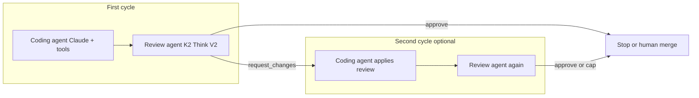

# PR workflow: multi-agent (coding + review)

This document describes the **planned** end-to-end pull-request workflow for `dev-sim` using two agents, a hard cap on how many times coding and review may loop, and a **structured review** contract the coding agent can consume for follow-up edits.

The current CLI still exposes mainly the **single** coding agent with tools; the review agent and the orchestration loop are **to be implemented** on top of this spec.

## Goals

- The **coding agent** uses **Claude** (Anthropic **Messages** API with **tool use**) to: work in a local workspace, talk to **GitHub** (create repo, metadata, open PR, registry), and use **git** (branch, commit, push) as already modeled in the coding stack.
- The **review agent** uses **K2 Think V2** to inspect what the coding agent produced (e.g. diff, files, or PR context) and return a **structured** review—not only prose.
- The coding agent can use that structure to **edit the branch** and **update the PR** without guessing from free-form chat alone.
- **At most two** full **(code → review)** iterations: no third round of “address review then re-review” in scope for v1 of this design.

## Terminology

| Term | Meaning |
|------|--------|
| **Coding agent** | Claude + tools (`create_github_repository`, `git_clone_repository`, `write_workspace_file`, `run_git`, `create_github_pull_request`, registry tools, etc.). |
| **Review agent** | K2 Think V2, OpenAI-compatible API (see `tools/k2_tools.py` and `K2_API_KEY` / K2 base URL). Output must match the review **contract** below. |
| **Iteration** | One pass of **review** after a **coding** phase. A full loop is: coding work → **review** → (optional) coding work again → **review** again. |

## Iteration limit (two rounds)

**Rule:** The automated workflow runs **at most two review steps** and **at most two “address the review” coding passes** after the initial implementation.

Suggested interpretation for implementers:

1. **Initial coding** — Implementer creates/updates the branch, commits, opens or updates a PR (per existing system prompt: feature branch, not merging its own PR).
2. **Review 1** — Review agent returns structured `CodeReviewResult` (see below).
3. If `verdict` is **`request_changes`**: **coding pass 1** — Coding agent applies fixes from the review (and pushes to the same branch / updates PR as needed).
4. **Review 2** — Review agent runs again on the new diff.
5. If `verdict` is still **`request_changes`**: **coding pass 2** — One more fix pass (optional in policy: can stop after one fix pass; this spec allows **up to two** fix passes to align with “2 iterations”).
6. **Stop** — No **third** full review. Further work is **human** (merge, comment, or out-of-band tools).

**Counting “2 iterations”:** Treat **“2 iterations”** as **two (coding → review) cycles** after the first deliverable, or equivalently **two review outcomes** on top of the first submission. The important invariant is: **no third automated review** and **no unbounded** code–review loops.

Orchestrators should encode this with an explicit `review_count` / `fix_pass` cap in code (e.g. `max_review_rounds = 2`).

## Review contract (structured output)

The review agent’s machine-readable output must follow **`shared/review_schema.py`**:

- Root type: **`CodeReviewResult`** — `schema_version` (e.g. `1.0.0`), `summary`, `verdict` (`approve` | `request_changes` | `comment_only`), `issues` (with `severity`, `suggested_fix`, optional `location`), `suggested_edits`, `follow_up_tasks`, optional `review_context`.
- JSON Schema for tools or validation: **`REVIEW_RESULT_JSON_SCHEMA`** in the same module.
- The **coding agent** should prioritize **`issues`** by **severity** (blocker first), then **`suggested_edits`**, then **`follow_up_tasks`**, as described in that file.

Reviewers should write **`suggested_fix` / `instruction` fields** so the coding agent can map them to `write_workspace_file` and `run_git` without re-deriving intent from narrative alone.

## Data flow (high level)

- **Input to review agent:** e.g. git diff, file list, PR URL, and/or prior `review_context`—exact inputs are an implementation choice.
- **Input to coding agent (after review):** JSON (or stringified JSON) matching `CodeReviewResult`, plus the usual user/task context and workspace state.

## Credentials and models (expectations)

| Role | API | Env / notes |
|------|-----|---------------|
| Coding agent | Anthropic | `ANTHROPIC_API_KEY`; model from `config` / `ANTHROPIC_MODEL` / CLI `--model` (Claude). |
| Review agent | K2 (OpenAI-compatible) | e.g. `K2_API_KEY` and K2 base URL; model id for K2 Think V2 as used in `tools/k2_tools.py`. |
| GitHub from coding agent | GitHub REST | `GITHUB_TOKEN` (unchanged). |

## Out of scope for this document

- Exact orchestration process (separate `dev-sim` subcommand vs. a Python driver script).
- Whether the second “review” is full-file or diff-only.
- Merging the PR: remains **human** (or a separate policy), consistent with the existing coding system prompt.
- **Fork**-based PRs, **draft**-only policy, and CI gates—unless added later in code.

## Related files

- Coding behavior and tools: `src/dev_sim/coding_agent.py`, `src/dev_sim/config.py`, `src/dev_sim/cli.py`
- Review contract: `shared/review_schema.py`
- Example K2 client: `tools/k2_tools.py`

---

*This file is a design spec; behavior may diverge until the review agent and multi-agent driver are implemented.*
